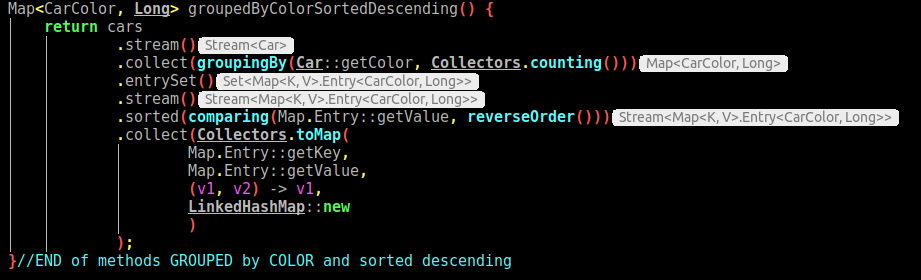
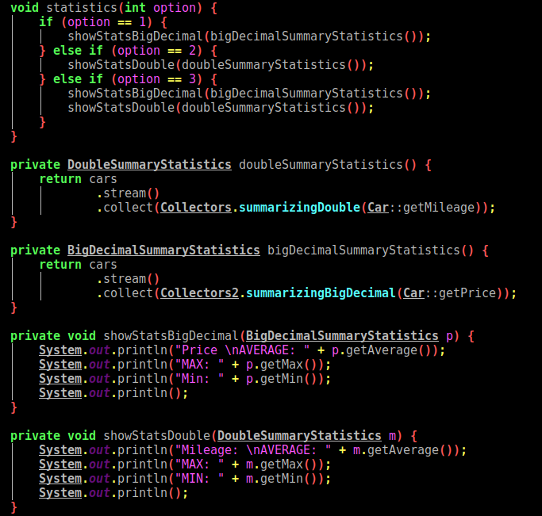

### CARS_COLLECTION_MANAGEMENT

#### Table of contents
* [General info](#general-info)
* [Software](#software)
* [Features](#features)
* [Screenshots](#screenshots)
* [Setup](#setup)
* [Status](#status)

#### General info
This simple program helps you to easy manage your cars (for car dealer).
> You can add car or cars, sort them, change some values or delete -> manage your cars collection

#### Features
0. Data generator service generate random data to JSON file.
1. Show you all cars which are saved in JSON file.
2. Sort cars - type methods:
* Ascending or Descending
* by Model
* by Color
* by Price
* by Mileage
3. Return collection of cars with mileage greater than specified.
4. Collection grouped by color, counted and sorted descending
5. Gropued by model and price
6. Statistics
7. Car with highest price
8. Sort components alphabetically
9. Component -> List car
10. Cars in price range [a,b]
11. Add car

To-do list:
* JUnit tests
* CRUD

#### Screenshots
* Data generator service generate random data to JSON file.

* Sort cars - type methods:

* Group by

* Statistics

#### Software
* Java 8 -> functional programming
* JSON, GSON
* Reflection
* Builder, Lombok
* Maven - quickstart
* IntelliJ IDEA

#### Setup
Main -> App class
> javac App.java
> java App.java

#### Code Examples
###### Number 9
        return cars
                .stream()
                .flatMap(k -> k.getComponents().stream())
                .distinct()
                .collect(Collectors.toMap(
                        component -> component,
                        component -> cars.stream().filter(
                                car -> car.getComponents()
                                        .contains(component))
                                .collect(Collectors.toList())
                ))
                .entrySet()
                .stream()
                .collect(Collectors.toMap(Map.Entry::getKey, Map.Entry::getValue, (v1, v2) -> v1, LinkedHashMap::new));
 
###### Number 10
        if (fromPrice == null) {
            throw new MyException("FROM PRICE IS NULL");
        }

        if (toPrice == null) {
            throw new MyException("TO PRICE IS NULL");
        }

        if (fromPrice.compareTo(toPrice) >= 0) {
            throw new MyException("FROM PRICE IS GREATER OR EQUALS THAN TO PRICE");
        }

        return cars
                .stream()
                .filter(c -> c.getPrice().compareTo(fromPrice) >= 0 && c.getPrice().compareTo(toPrice) <= 0)
                .sorted(Comparator.comparing(Car::getModel).reversed())
                .collect(Collectors.toCollection(LinkedHashSet::new));

#### Status
Project is: _in progress_
