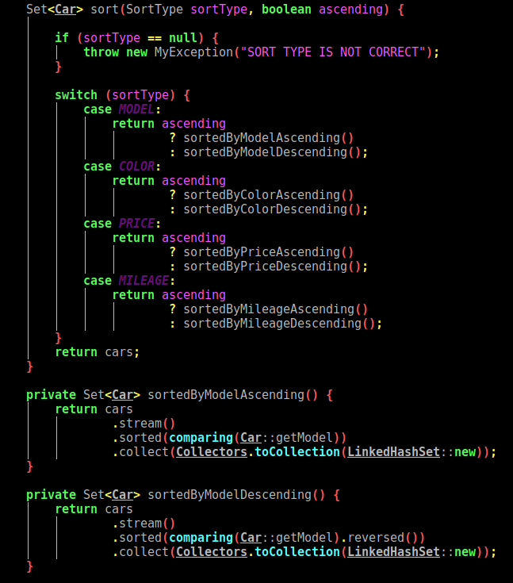

### CARS_COLLECTION_MANAGEMENT

## Table of contents
* [General info](#general-info)
* [Features and Screenshots](#features-and-Screenshots)
* [Technologies](#technologies)
* [Setup](#setup)
* [Status](#status)
* [Inspiration](#inspiration)

## General info
This simple program helps you to easy manage your cars (for car dealer).
> You can add car or cars, sort them, change some values or delete -> manage your cars collection

## Features and Screenshots
0. Data generator service generate random data to JSON file.

1. Show you all cars which are saved in JSON file.
2. Sort cars - type methods
* Ascending or Descending
* by Model
* by Color
* by Price
* by Mileage

To-do list:
* JUnit tests
* CRUD

## Technologies
* Java 8 -> functional programming
* JSON, GSON
* Reflection
* Builder, Lombok
* Maven - quickstart

## Setup
Describe how to install / setup your local environement / add link to demo version.

## Code Examples
Show examples of usage:
`Map<String, List<Car>> componentWithListOfCars() {

        return cars
                .stream()
                .flatMap(k -> k.getComponents().stream())
                .distinct()
                .collect(Collectors.toMap(
                        component -> component,
                        component -> cars.stream().filter(
                                car -> car.getComponents()
                                        .contains(component))
                                .collect(Collectors.toList())
                ))
                .entrySet()
                .stream()
                .collect(Collectors.toMap(Map.Entry::getKey, Map.Entry::getValue, (v1, v2) -> v1, LinkedHashMap::new));
}`

## Status
Project is: _in progress_

## Inspiration
Add here credits. Project inspired by..., based on...
